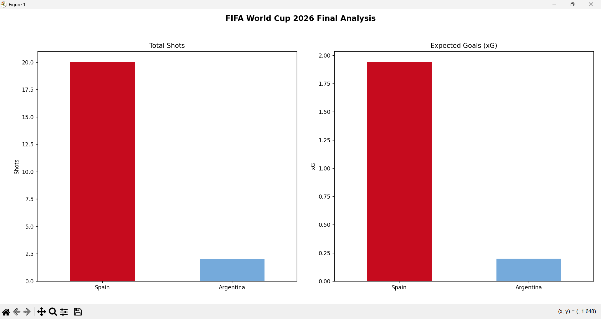
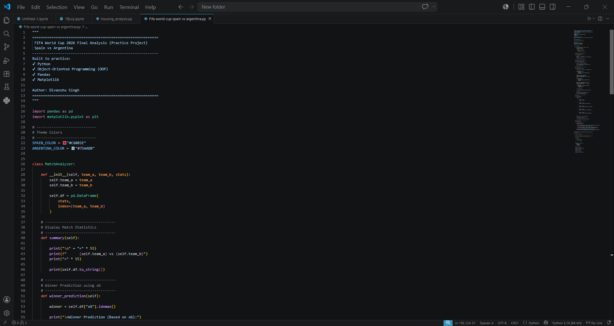
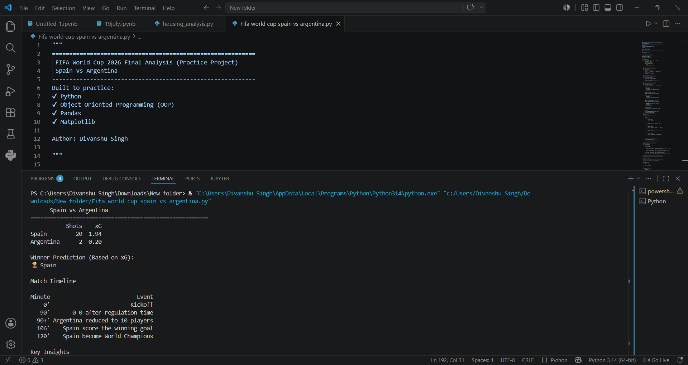

# ⚽ FIFA World Cup 2026 Final Analysis using Python


> **Turning a Real-World Football Match into a Python Data Analysis Project**

---

## 📖 Overview

Instead of simply watching the **FIFA World Cup 2026 Final**, I transformed it into a small Python data analysis project to practice programming and analytical thinking.

This project demonstrates how real-world sports events can be explored using **Python**, **Pandas**, **Matplotlib**, and **Object-Oriented Programming (OOP)**.

> **Note:** This project uses sample statistics for educational and Python practice purposes.

---

## 🛠️ Technologies Used

- 🐍 Python
- 🐼 Pandas
- 📊 Matplotlib
- 🧩 Object-Oriented Programming (OOP)

---

## ✨ Features

- 📊 Match Statistics Summary
- ⚽ Expected Goals (xG) Analysis
- 🎯 Total Shots Comparison
- 🏆 Winner Prediction (Based on xG)
- 📅 Match Timeline
- 📈 Data Visualization
- 🧹 Clean OOP Code Structure

---

# 📸 Project Preview

## 📊 Match Statistics Visualization



---

## 💻 Python Source Code



---

## ▶️ Program Output



---

## 📂 Project Structure

```text
fifa-world-cup-2026-python-analysis
│
├── analysis.py
├── README.md
├── requirements.txt
├── LICENSE
├── fifa world cup cover image.png
├── charts.png
├── code.png
└── terminal.png
```

---

## 🚀 Installation

Clone the repository

```bash
git clone https://github.com/singhdivanshu455-star/fifa-world-cup-2026-python-analysis.git
```

Install dependencies

```bash
pip install -r requirements.txt
```

Run the project

```bash
python analysis.py
```

---

## 📚 Learning Outcomes

Through this project, I practiced:

- Writing clean Python code
- Object-Oriented Programming (OOP)
- Data manipulation using Pandas
- Data visualization with Matplotlib
- Converting real-world events into data analysis projects

---

## 🔮 Future Improvements

- Read data from CSV files
- Add Possession Analysis
- Pass Accuracy Comparison
- Interactive Dashboard
- Additional Match Statistics

---

## 👨‍💻 Author

**Divanshu Singh**

- GitHub: https://github.com/singhdivanshu455-star

⭐ If you found this project interesting, consider giving it a **Star**.
